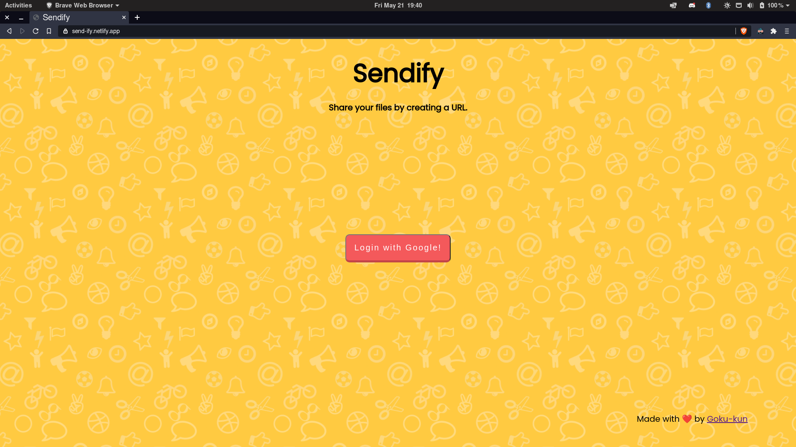
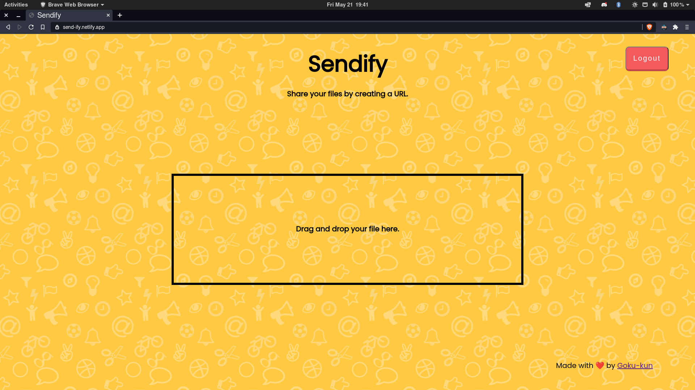
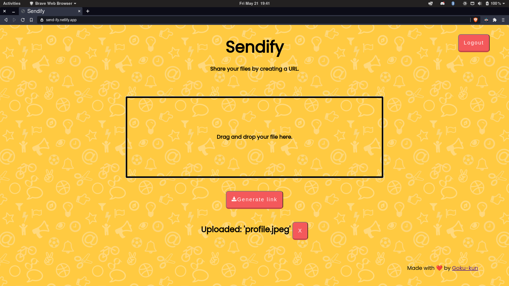
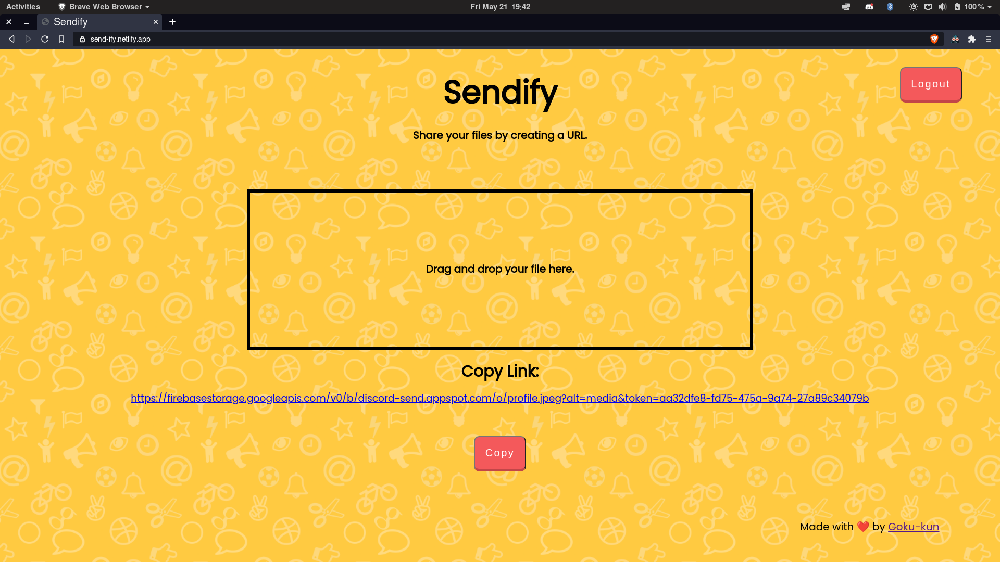

# Sendify
An application for sharing using drag and drop upload and sharing the download link among the group.

> Live demo [_here_](https://send-ify.netlify.app).

## Table of Contents
* [General Info](#general-information)
* [Technologies Used](#technologies-used)
* [Features](#features)
* [Screenshots](#screenshots)
* [Setup](#setup)
* [Project Status](#project-status)
* [Room for Improvement](#room-for-improvement)
* [Acknowledgements](#acknowledgements)
* [Contact](#contact)
* [License](#license) 

## General Information
- This application primarly intends to solve the discord upload limit of 8MB on Guilds with no levels by providing the users a way to upload files and generate URL to share it with others.
- However, it can be used to upload any file and generate a URL.

## Technologies Used
- ReactJS
- Firebase

## Features

- Drag and Drop your files if you don't want to click on the button and select from a file manager pop up.
- A copy button to help copy the generated URL without the need of selecting and copying it although even this can be done. Totally User's choice.

## Screenshots

## Setup
1. To build this project, install the dependencies and the run `npm run build`. That's it.

## Project Status
Project is: "version - 1.0.0" is live .

## Room for Improvement

To do:
- Add pause and cancel buttons to pause and cancel uploads respectively.
- Integrate with a URL shortner to shorten the generated URL.
- Provide interface to upload multiple files.

## Acknowledgements
- This project is solely done by me trying to solve the upload size limit problem.

## Contact
Created by [@Goku-kun](https://github.com/Goku-kun) - feel free to contact me!

 ## License 
 This project is open source and available under the [GNU GPL Version 3](./LICENSE). 

